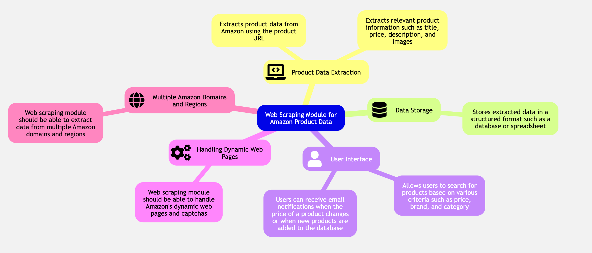

# ShopWise
A Web Scraping project using NextJs, MongoDB and Tailwind CSS.

## Live 
https://shopwise-inky.vercel.app

## Overview

This project is a web scraping application designed to collect product information from Amazon. It utilizes Node.js with the Next.js framework for the web application, MongoDB for data storage, and BrightData for scraping, and send email notifications to users when there are changes in the product details. The project includes a web application with a user-friendly interface that allows users to search for products, view product details, and subscribe to product updates. 

The server-side logic is implemented with serverless functions that handle various tasks such as connecting to the database, scraping product details, updating product information, and sending email notifications. 

## Project Structure

```plaintext
ShopWise/
|-- app/
|   |-- product/
|        |-- page.tsx                # Products page
|   |-- page.tsx                     # Index page
|-- components/                      # Project components                  
|-- lib/                          
|   |-- actions/
|       |-- index.ts                 # Main script to run the scraping process
|      |-- scraper/                    
|          |-- index.ts              # Amazon scraper module
|   |-- models/
|       |-- product.models.ts        # Product Schema module
|   |-- nodemailer/
|       |-- index.ts                 # Mail Service module
|   |-- mongoose.ts                  # MongoDB connection setup
|   |-- utils.ts                     # Utilities module
|-- node_modules/
|-- .gitignore
|-- package.json
|-- README.md
```

## Mind Map



# Technologies and Frameworks

- Next.js
- Tailwind CSS
- TypeScript
- MongoDB
- Nodemailer
- Axios
- Cheerio
# Installation

Follow these steps to install and run the project:

1. **Clone the repository**

   Open your terminal and run the following command to clone the repository:

   ```bash
   git clone 
   https://github.com/mostafamaa1/shopwise.git
   ```

2. **Navigate to the project directory**

   ```bash
   cd shopwise
   ```


3. **Install the required packages**

   The project requires several packages to be installed. Run the following command to install them:

   ```bash
   npm i
   ```

4. **Install the required fonts**

   The project requires the "font-inter" and "font-spaceGrotesk" fonts to be available. You can download them from [Google Fonts](https://fonts.google.com/).

5. **Set up the environment variables**

   The project requires the MONGODB_URI environment variable to be defined. You can do this in a `.env` file in the root of your project:

   ```bash
   BRIGHT_DATA_USERNAME=BRIGHT_DATA_USERNAME
   BRIGHT_DATA_PASSWORD=BRIGHT_DATA_PASSWORD
   MONGODB_URI=your_mongodb_uri
   EMAIL_PASSWORD=for_nodemailer_email
   ```

6. **Start the server**

   Run the following command to start the server:

   ```bash
   npm run start
   ```

Now, you should be able to access the project at `http://localhost:3000`.

Please note that the project requires the "m.media-amazon.com" domain to be accessible for image handling. If you are unable to access this domain, you may encounter issues with image loading.
